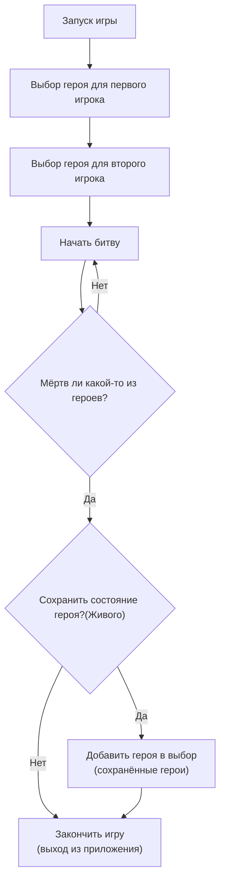
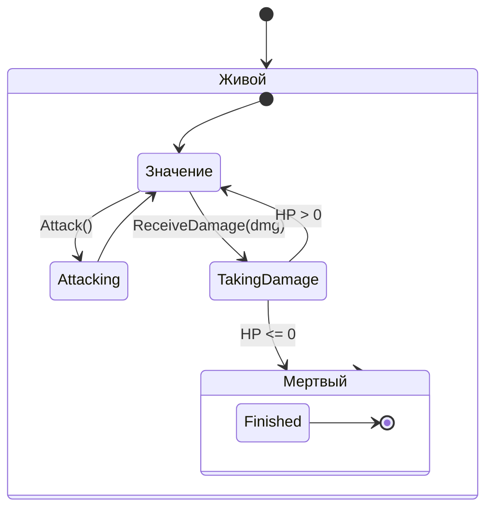

ЗАДАНИЕ.
Игра "Герои" (текстовый hack-and-slash).
Необходимо реализовать несколько разных героев, которые могут атаковать друг друга.
Необходимо реализовать возможность сохранения и восстановления состояния героя.
Необходимо реализовать текстовый интерфейс для игры.
Над балансом игры можно не думать.

Также необходимо применять паттерны и принципы SOLID, желательно сделать слоёную архитектуру приложения, желательно заложить возможность дальнейшей доработки приложения.

Для начала нужно сделать диаграммы для понимания что и как будет происходить в игре

Диаграмма действий Играков:

Диаграмма состояния Героя:

